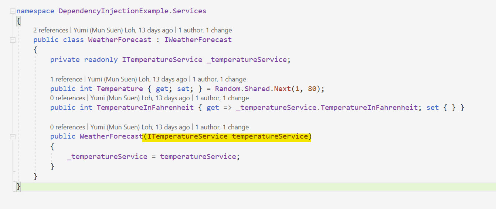

# Dependency Injection

## Captive dependency
From the first post in the series, we can conclude that `AddSingleton` has the longest lifetime, followed by `AddScoped` and `AddTransient`. 

Using the same example from the first post, `WeatherForecast` has a dependency on `TemperatureService`.

The most straight-forward way to check what dependencies the service has is via the constructor [provided that you follow the best practices and don't use the service locator pattern ;) ] 


So from here we know that `WeatherForecast` depends on `TemperatureService`. 

However, if we look at `Program.cs`:
```
builder.Services.AddSingleton<IWeatherForecast, WeatherForecast>();
builder.Services.AddScoped<ITemperatureService, TemperatureService>();
```

`WeatherForecast` is registered as a singleton service, but `TemperatureService` is registered as a scoped service. The lifetime of a singleton service is longer than a scoped or transient service. In this case, even though `TemperatureService` is registered as a scoped service, it cannot exhibit scoped characteristics because it's trapped in the singleton service. 

This is what it means by Captive dependency. The singleton service is holding the scoped service captive, forcing the scoped service to behave as a singleton. This unexpected behavior might be the cause of some difficult-to-track bugs.

An interesting note is that if captive dependency occurs, a runtime error will be thrown in development environment ONLY. 

In `Properties/launchsettings.json`, if we change `ASPNETCORE_ENVIRONMENT` to LocalDevelopment, Staging, or Production, we won't be getting this error. Instead, the scoped service will be behaving like a singleton service. 

```
System.AggregateException: Some services are not able to be constructed (Error while validating the service descriptor 'ServiceType: DependencyInjectionExample.Interfaces.IWeatherForecast Lifetime: Singleton ImplementationType: DependencyInjectionExample.Services.WeatherForecast': Cannot consume scoped service 'DependencyInjectionExample.Interfaces.ITemperatureService' from singleton 'DependencyInjectionExample.Interfaces.IWeatherForecast'.)
```
The highlight of the error is  `Cannot consume scoped service 'DependencyInjectionExample.Interfaces.ITemperatureService' from singleton 'DependencyInjectionExample.Interfaces.IWeatherForecast'`

There are a few ways to resolve this: 
- Option 1: Both dependencies have the same lifetime. 
- Option 2: The child dependency have a longer lifetime than the parent dependency. 
    i.e. register `TemperatureService` as singleton while `WeatherService` as scoped. This will also work, but I don't see any reason to do this. In the end, the singleton service will also behave like a scoped service, so what's the point? I would suggest register the parent/child/grandchildren dependencies with the same lifetime. 


## Enable Scope Validation

Ideally, we would like to detect such errors in local development. The way to do it will be using the `ValidateScopes` flag which we can set to true. 


Add this line in `Program.cs` after `WebApplication.CreateBuilder(args);`,
```
builder.Host.UseDefaultServiceProvider(options => options.ValidateScopes = true);
```
the same error will be thrown once the endpoint is executed. 
<br>
<br>
<br>
Note the slight difference under different configurations:

`ASPNETCORE_ENVIRONMENT: "Development"` alone will throw an error at `builder.Build();` and stop running instantly.

`ASPNETCORE_ENVIRONMENT: "LocalDevelopment / Staging / Production"` and `builder.Host.UseDefaultServiceProvider(options => options.ValidateScopes = true);` will run as usual, but will throw an error when the endpoint is executed. 

`ASPNETCORE_ENVIRONMENT: "Development"` and `builder.Host.UseDefaultServiceProvider(options => options.ValidateScopes = true);` will run as usual, but will throw an error when the endpoint is executed. 

So, we can conclude that `builder.Host.UseDefaultServiceProvider(options => options.ValidateScopes = true);` ensure that the program can still run, but will only throw the error upon reaching the dependency where captive dependency occurs.

Whereas in development environment, the web api cannot even run. 

<br>
<br>
<br>


Resources:

https://learn.microsoft.com/en-us/dotnet/core/extensions/dependency-injection-guidelines?source=recommendations#captive-dependency
